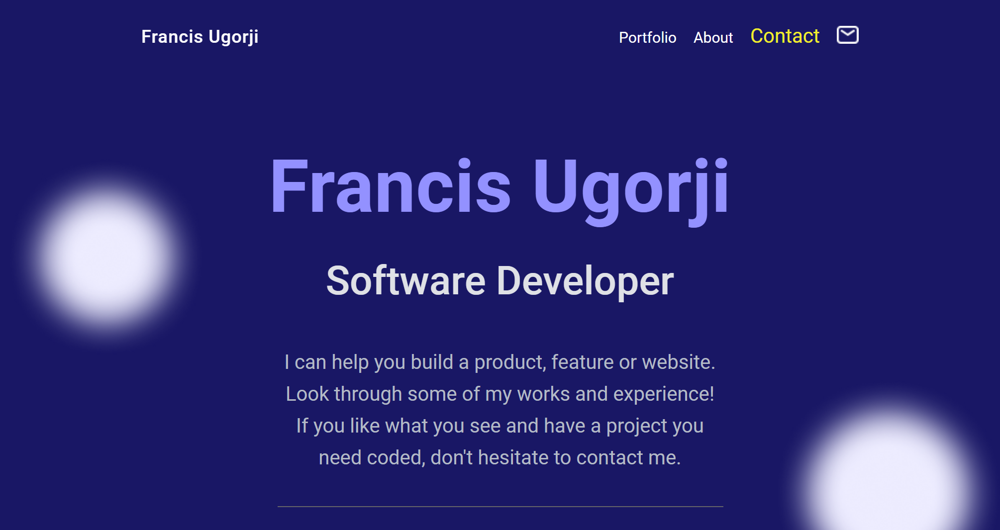

# Personal Portfolio

> This website contains some of my recent projects. If you want to see the live demonstration and source code for each project, click the `See Projects` button for each card, a popup window will appear, scroll down and click either of the `See Live` or `See Source` buttons.

> |Mobile Version|Desktop Version|
> |--------------|---------------|
> |||

## Live Demo Link
[Live Demo Link](https://gambit142.github.io/Template-Portfolio/)

## Built With

- HTML
- CSS
- Visual Studio Code Editor
- Git & Github

## Getting Started
To get a local copy up and running:
1. Clone this repository or download the Zip folder:
**``https://github.com/Gambit142/Template-Portfolio.git``**
1. Navigate to the location of the folder in your machine:
**``you@your-Pc-name:~$ cd <folder>``**

## Authors

👤 **Francis Nzenwa Ugorji**

- GitHub: [@githubhandle](https://github.com/Gambit142)
- LinkedIn: [LinkedIn](https://www.linkedin.com/in/francis-ugorji-a567b7168) 

## Contributors
👤 **Iyadi Cyril**

- GitHub: [@githubhandle](https://github.com/see-why))

👤 **Radmila Stojceva**

- GitHub: [@githubhandle](https://github.com/M0rrighan))

👤 **Ajise Toluwase**

- GitHub: [@githubhandle](https://github.com/Whoistolu))

👤 **Ugbordiegwu Chimaijem Sixtus Paul**

- GitHub: [@githubhandle](https://github.com/Gentilitysp))

## 🤝 Contributing

Contributions, issues, and feature requests are welcome!

Feel free to check the [issues page](https://github.com/Gambit142/Template-Portfolio/issues).

## Show your support

Give a ⭐️ if you like this project!

## Acknowledgments

- Hat tip to Figma for providing us with their template [Figma Template](https://www.figma.com/file/l7SqJ3ZfkAKih9sFxvWSR4/Microverse-Student-Project-1?node-id=48%3A2346)
- Hat tip to Microverse for well curated curriculum. Microverse [Home Page](https://bit.ly/MicroverseTN
)
- My Coding Partners 🏹
- My Morning Session Partners ⚡
- DarkCode for their YouTube tutorials on animation. You can check out their [Instagram Account](https://www.instagram.com/darkcodeonline)

## 📝 License

This project is [MIT](./MIT.md) licensed.