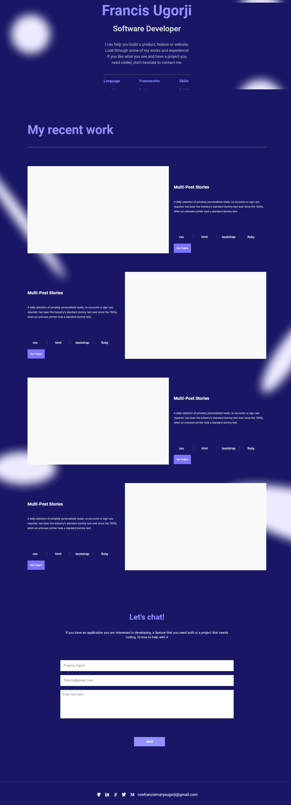

# Mobile Version
 

> This project is a Microverse project given to students and it entails replicating a figma mobile version template

## Live Demo Link
[Live Demo Link](https://gambit142.github.io/Mobile-Version/)

## Built With

- HTML
- CSS
- Visual Studio Code Editor
- Git & Github

## Getting Started
To get a local copy up and running:
1. Clone this repository or download the Zip folder:
**``git clone https://github.com/Gambit142/Mobile-Version.git``**
2. Navigate to the location of the folder in your machine:
**``you@your-Pc-name:~$ cd <folder>``**

## Authors

👤 **Francis Nzenwa Ugorji**

- GitHub: [@githubhandle](https://github.com/Gambit142)
- LinkedIn: [LinkedIn] (www.linkedin.com/in/francis-ugorji-a567b7168) 

👤 **Iyadi Cyril**

- GitHub: [@githubhandle](https://github.com/see-why))

## 🤝 Contributing

Contributions, issues, and feature requests are welcome!

Feel free to check the [issues page](../../issues/).

## Show your support

Give a ⭐️ if you like this project!

## Acknowledgments

- Hat tip to Figma for providing us with their template [Figma Template](https://www.figma.com/file/l7SqJ3ZfkAKih9sFxvWSR4/Microverse-Student-Project-1?node-id=48%3A2346)
- Hat tip to Microverse for well curated curriculum. Microverse [Home Page](https://bit.ly/MicroverseTN
)
- My Coding Partners 🏹
- My Morning Session Partners ⚡
- DarkCode for their YouTube tutorials on animation. You can check out their [Instagram Account](https://www.instagram.com/darkcodeonline)

## 📝 License

This project is [MIT](./MIT.md) licensed.